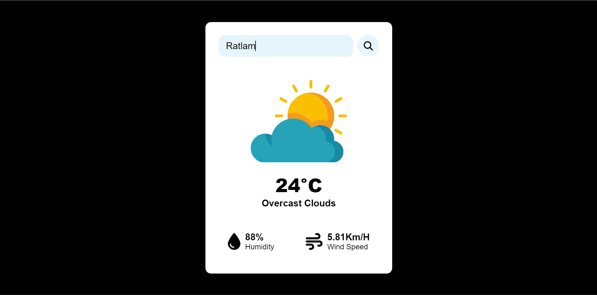

# 🌦️ Weather App

A sleek and minimalist weather forecast web application built with HTML, CSS, and JavaScript. It allows users to search any city and get real-time weather information including temperature, humidity, and wind speed.

🔗 **Live Demo:** [https://akshat-tated.github.io/weather_app/](https://akshat-tated.github.io/weather_app/)

---

## 🛠 Features

- 🔍 Search weather by city name
- 🌡️ Displays temperature in Celsius
- 🌥️ Shows current weather condition with icon
- 💧 Humidity and 🌬️ wind speed display
- 🔄 Press "Enter" to search quickly
- ❌ Error handling for invalid city names

---

## 📸 Screenshots

### ✅ Weather Found


### ❌ Invalid Location


---

## ⚙️ Tech Stack

- **HTML5** + **CSS3**
- **Vanilla JavaScript**
- [OpenWeatherMap API](https://openweathermap.org/api)
- **GitHub Pages** (for hosting)

---

## 🚀 Getting Started (Local)

```bash
# Clone the repository
git clone https://github.com/akshat-Tated/weather_app.git

# Open index.html in your browser
```

To use your own OpenWeatherMap API key:
- Go to [https://openweathermap.org/](https://openweathermap.org/)
- Sign up and generate a free API key
- Replace the `api_key` value inside `script.js`:
```js
const api_key = "YOUR_API_KEY_HERE";
```

---

## 📁 Folder Structure

```
weather_app/
├── index.html
├── style.css
├── script.js
├── assets/
│   ├── cloud.png
│   ├── clear.png
│   ├── rain.png
│   ├── mist.png
│   ├── snow.png
│   ├── 404.png
│   ├── weather-found.png       <-- Screenshot
│   └── location-not-found.png  <-- Screenshot
```

---

## 🧑‍💻 Author

**Akshat Tated**  
🔗 [LinkedIn](https://www.linkedin.com/in/akshat-tated)  
🔗 [GitHub](https://github.com/akshat-Tated)

---

